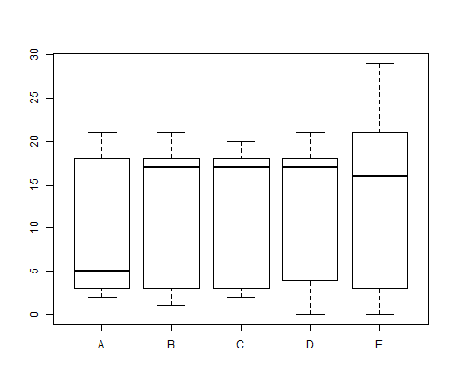
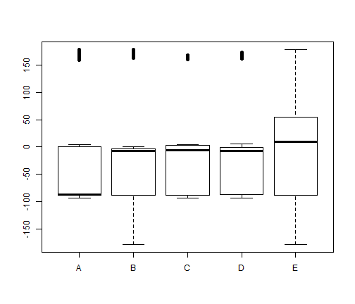
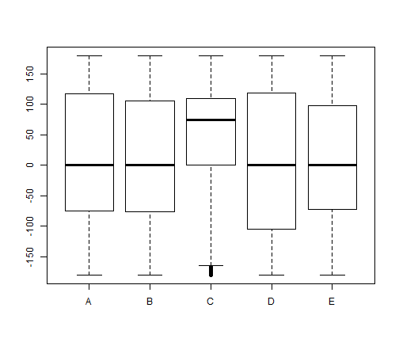
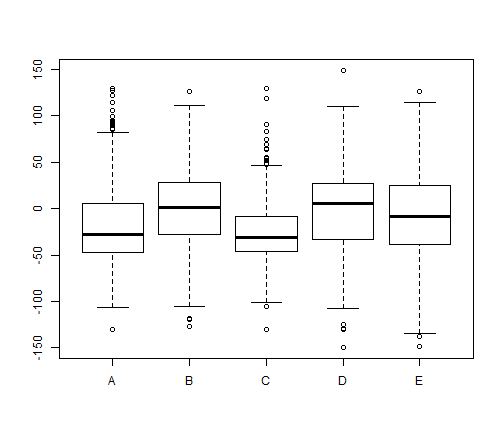
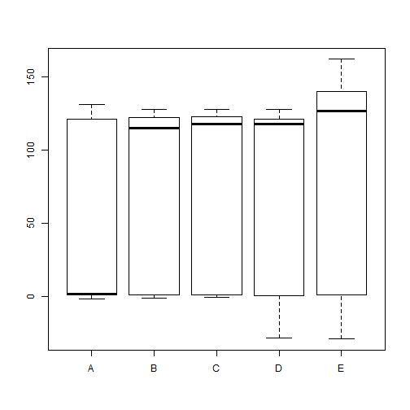
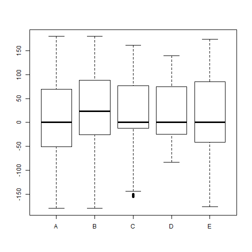
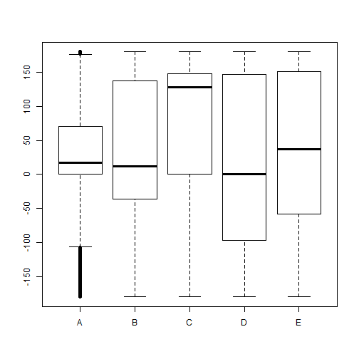

Predicting Exercise Style
========================================================


```r
pmltraining <- read.csv("C:/Users/Chris Curran.ThinkPadCC/Documents/Cousera/MachineLearning/pml-training.csv", header = TRUE)
library(caret)
```

```
## Loading required package: lattice
## Loading required package: ggplot2
```

```r
library(AppliedPredictiveModeling)
set.seed(3433)
inTrain = createDataPartition(pmltraining$classe, p = 3/4)[[1]]
pmltraining2 = pmltraining[ inTrain,]
pmltesting2 = pmltraining[-inTrain,]
```

I will now work in the new training dataset to develop a predictive model.  I begin by creating plots against each of the total variables under the assumption that the total variables may capture consolidated information about each component of the user's movement.  Revealed in the graph below is that the variable total_accel_belt is a strong predictor of class A outcome.  Each of the other three total variables (arm, dumbbell, and forearm) did not demonstrate such pronounced relationships.


```r
#This plot seems to discriminate A well
plot(pmltraining2$classe, pmltraining2$total_accel_belt)
```

 


```r
#yaw_belt is a good predictor of A
plot(pmltraining2$classe, pmltraining2$yaw_belt)
```

 


```r
#yaw_forearm gives good discrimination of C
plot(pmltraining2$classe, pmltraining2$yaw_forearm)
```

 


```r
#This distinguishes B and D well from A and D
plot(pmltraining2$classe, pmltraining2$pitch_dumbbell)
```

 


```r
#A good predictor of A
plot(pmltraining2$classe, pmltraining2$roll_belt)
```

 

```r
#An ok predictor of B
plot(pmltraining2$classe, pmltraining2$roll_arm)
```

 

```r
#A decent predictor of C
plot(pmltraining2$classe, pmltraining2$roll_dumbbell)
```

 

```r
#A good predictor of C
plot(pmltraining2$classe, pmltraining2$roll_forearm)
```

 

I try running a regression model to predict; however, this doesn't seem to work on a factor variable outcome.I conclude that a regression model won't work because the outcome variable is a factor variable.

```r
#Run a regression model using predictors from above

lml <- lm(classe ~ roll_forearm + roll_dumbbell + roll_arm + roll_belt + pitch_dumbbell + yaw_forearm + yaw_belt + total_accel_belt, data = pmltraining)
```

```
## Warning in model.response(mf, "numeric"): using type = "numeric" with a
## factor response will be ignored
```

```
## Warning in Ops.factor(y, z$residuals): - not meaningful for factors
```


I will now try a random forest approach.  I try several different models beginning with the variables that I identified in my graphs. I then build up by adding other probable variables.  The final model predicts an accuracy rate of about 86%.  I run this on the file pmltesting2, which is the test set I created.  The table below shows the success of the predictors.


```r
inTrain = createDataPartition(pmltraining$classe, p = 1/20)[[1]]
pmltraining3 = pmltraining[ inTrain,]

#This model is getting about 80% accuracy
modFit <- train(classe ~ roll_forearm + roll_dumbbell + roll_arm + roll_belt + pitch_dumbbell + yaw_forearm + yaw_belt + total_accel_belt, data = pmltraining3, method="rf", prox=TRUE, ntree= 100)
```

```
## Loading required package: randomForest
## randomForest 4.6-10
## Type rfNews() to see new features/changes/bug fixes.
```

```r
#This model gets about 80%
modFit <- train(classe ~ roll_forearm + roll_dumbbell + roll_arm + roll_belt + + pitch_forearm + pitch_arm + pitch_belt + pitch_dumbbell + yaw_forearm + yaw_belt + yaw_dumbbell + yaw_forearm +  total_accel_belt, data = pmltraining3, method="rf", prox=TRUE, ntree= 100)


#This model gets about 86%
modFit <- train(classe ~ roll_forearm + roll_dumbbell + roll_arm + roll_belt + + pitch_forearm + pitch_arm + pitch_belt + pitch_dumbbell + yaw_forearm + yaw_belt + yaw_dumbbell + yaw_forearm +  total_accel_belt + magnet_forearm_x + magnet_forearm_y + magnet_forearm_z + magnet_dumbbell_x + magnet_dumbbell_y + magnet_dumbbell_z + magnet_arm_x + magnet_arm_y + magnet_arm_z + magnet_belt_x + magnet_belt_y + magnet_belt_z, data = pmltraining3, method="rf", prox=TRUE, ntree= 100)

#This model gets about 86%
modFit <- train(classe ~ roll_forearm + roll_dumbbell + roll_arm + roll_belt + + pitch_forearm + pitch_arm + pitch_belt + pitch_dumbbell + yaw_forearm + yaw_belt + yaw_dumbbell + yaw_forearm +  total_accel_belt + magnet_forearm_x + magnet_forearm_y + magnet_forearm_z + magnet_dumbbell_x + magnet_dumbbell_y + magnet_dumbbell_z + magnet_arm_x + magnet_arm_y + magnet_arm_z + magnet_belt_x + magnet_belt_y + magnet_belt_z, data = pmltraining3, method="rf", prox=TRUE, ntree= 100)

pred <- predict(modFit, pmltesting2)
table(pred, pmltesting2$classe)
```

```
##     
## pred    A    B    C    D    E
##    A 1336   53    5    5    4
##    B   21  767   29    4   23
##    C    9   88  800   62   27
##    D   15   23   18  716   22
##    E   14   18    3   17  825
```

```r
pmltesting <- read.csv("C:/Users/Chris Curran.ThinkPadCC/Documents/Cousera/MachineLearning/pml-testing.csv", header = TRUE)
predfinal <- predict(modFit, pmltesting) 


pml_write_files = function(x){
  n = length(x)
  for(i in 1:n){
    filename = paste0("C:/Users/Chris Curran.ThinkPadCC/Documents/Cousera/MachineLearning/problem_id_",i,".txt")
    write.table(as.character(x[i]),file=filename,quote=FALSE,row.names=FALSE,col.names=FALSE)
  }
}

pml_write_files(as.character(predfinal))
```
